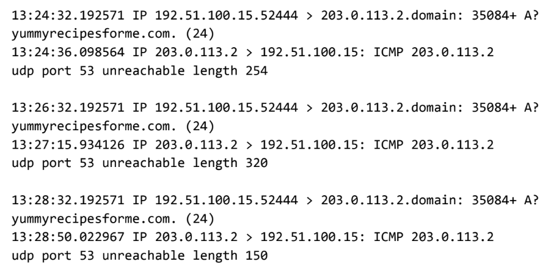

## Activity Overview

In this activity, you will analyze DNS and ICMP traffic in transit using data from a network protocol analyzer tool. You will identify which network protocol was utilized in assessment of the cybersecurity incident.

In the internet layer of the TCP/IP model, the IP formats data packets into IP datagrams. The information provided in the datagram of an IP packet can provide security analysts with insight into suspicious data packets in transit.

Knowing how to identify potentially malicious traffic on a network can help cybersecurity analysts assess security risks on a network and reinforce network security.

## Scenario

You are a cybersecurity analyst working at a company that specializes in providing IT services for clients. Several customers of clients reported that they were not able to access the client company website www.yummyrecipesforme.com, and saw the error “destination port unreachable” after waiting for the page to load.
